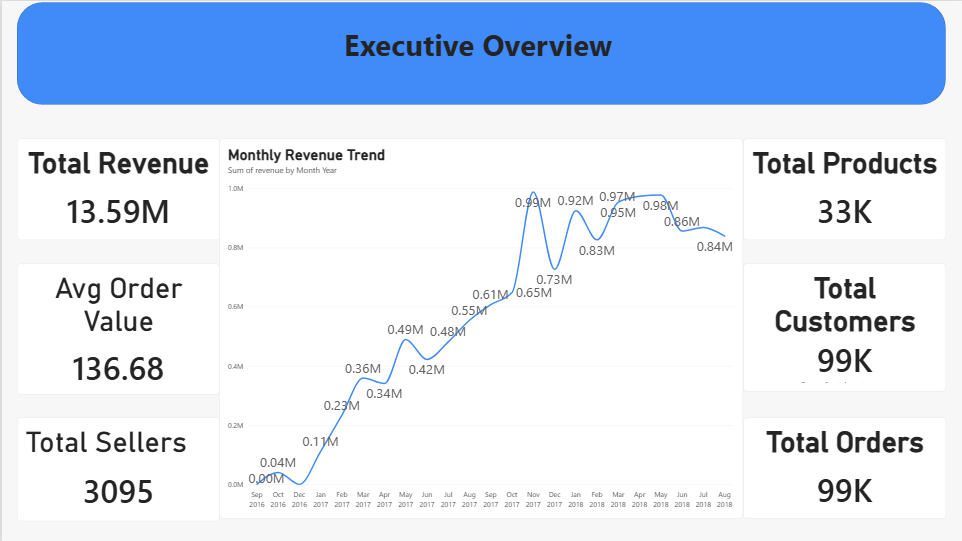
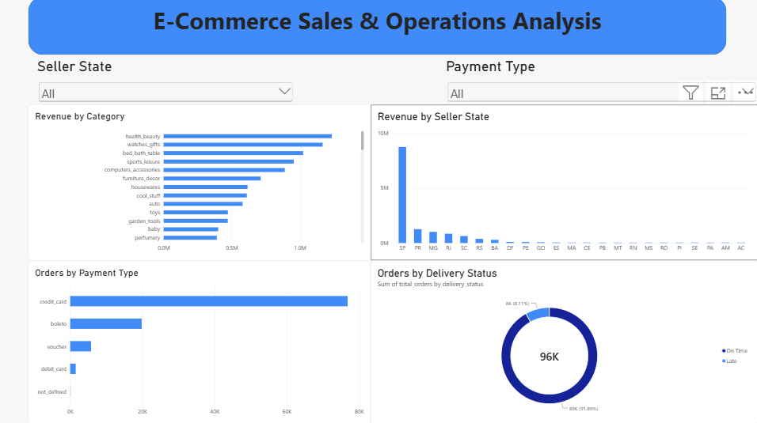
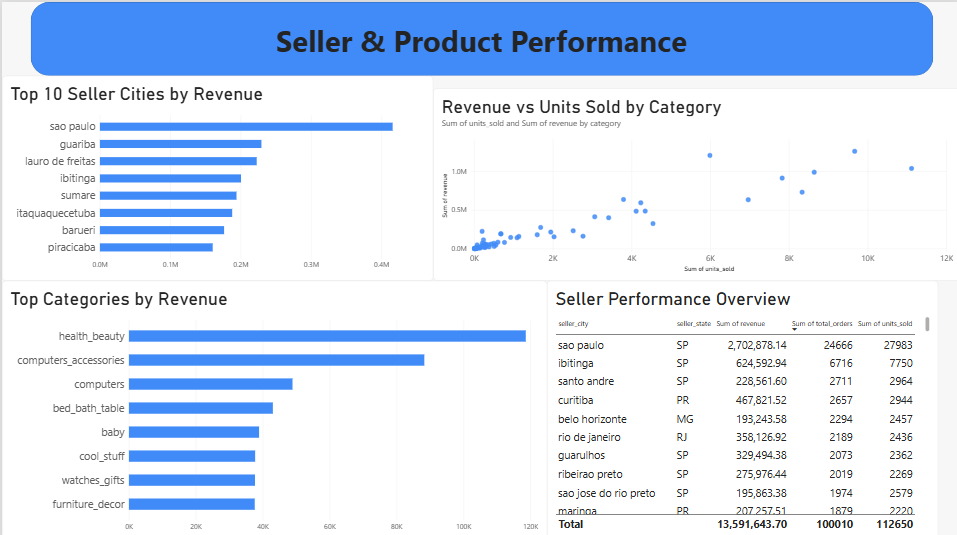

# E-Commerce Sales & Operations Analysis

## 📊 Project Overview

This project analyzes an e-commerce dataset to understand sales performance, customer behavior, seller performance, payment methods, product categories, and delivery operations.

An interactive Power BI dashboard was developed to transform raw e-commerce data into meaningful business insights and help understand key performance indicators.

---

## 🎯 Project Objectives

- Analyze overall e-commerce sales performance
- Track revenue and order trends over time
- Identify top-performing product categories
- Analyze seller performance across different locations
- Understand customer and order activity
- Analyze payment methods used by customers
- Evaluate delivery performance
- Create an interactive dashboard for business decision-making

---

## 🛠️ Tools & Technologies

- **Power BI Desktop**
- **Power Query**
- **DAX**
- **Data Modeling**
- **Data Visualization**
- **CSV Dataset**

---

## 📁 Dataset

The project uses the **Brazilian E-Commerce Public Dataset by Olist**.

The dataset contains information related to:

- Orders
- Customers
- Sellers
- Products
- Payments
- Reviews
- Product categories
- Delivery information
- Customer and seller locations

---

# 📌 Dashboard Pages

## 1. Executive Overview

The Executive Overview provides a high-level summary of the business performance.

### Key KPIs

- Total Revenue
- Average Order Value
- Total Sellers
- Total Products
- Total Customers
- Total Orders

### Visualizations

- Monthly Revenue Trend
- Overall business performance indicators



---

## 2. E-Commerce Sales & Operations Analysis

This page focuses on sales performance and operational analysis.

### Visualizations

- Revenue by Category
- Revenue by Seller State
- Orders by Payment Type
- Orders by Delivery Status

### Interactive Filters

- Seller State
- Payment Type

These filters allow users to interactively explore different parts of the business.



---

## 3. Seller & Product Performance

This page focuses on seller and product-category performance.

### Visualizations

- Top 10 Seller Cities by Revenue
- Top Categories by Revenue
- Revenue vs Units Sold by Category
- Seller Performance Overview

The seller performance table provides information such as:

- Seller City
- Seller State
- Revenue
- Total Orders
- Units Sold



---

# 💡 Key Business Insights

The analysis provides several useful business insights:

- A small number of product categories contribute significantly to overall revenue.
- Seller performance varies considerably across different locations.
- São Paulo represents one of the strongest seller markets.
- Credit cards are the dominant payment method.
- The majority of orders were delivered on time.
- Revenue and order activity can be tracked effectively through monthly trends.
- Seller and category-level analysis can help identify high-performing areas of the business.

---

# 🔄 Data Analysis Workflow

```text
Raw Dataset
     ↓
Data Cleaning & Transformation
     ↓
Power Query
     ↓
Data Modeling
     ↓
DAX Measures
     ↓
Interactive Power BI Dashboard
     ↓
Business Insights